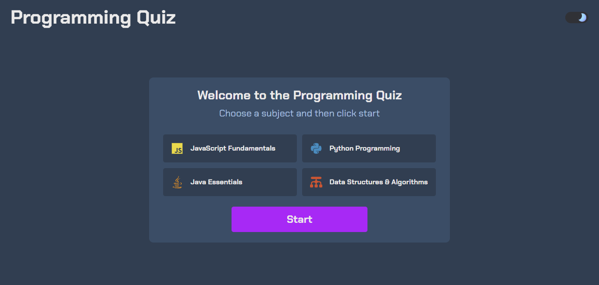

# Quiz App

This project is a responsive web-based quiz application focused on programming topics. Users can choose a subject (like JavaScript, Python, etc.), answer a series of 10 multiple-choice questions fetched dynamically, and receive immediate feedback. The app includes a timer for each question and displays the final score upon completion. It also features a theme toggle for light and dark modes.

## Table of contents

- [Screenshots](#screenshots)
- [Demo](#demo)
- [Built with](#built-with)
- [Lessons Learned](#lessons-learned)
- [Features](#features)
- [Author](#author)

## Screenshots

## Demo

[Live Demo Link](https://gustavo2023.github.io/quiz-app/)

## Built with

- Semantic HTML5 markup
- CSS custom properties
- Flexbox
- CSS Grid
- Mobile-first workflow
- JavaScript

## Lessons Learned

Building this quiz app provided valuable practice in several key areas of web development:

- **Asynchronous JavaScript (Fetch API):** Practiced on how to effectively use the `fetch` API to load external data (`data.json`). This involved handling Promises (`.then()`) to process the response and parse JSON, as well as implementing error handling (`.catch()`) for network or parsing issues. Understanding the asynchronous nature was crucial for ensuring data was available before setting up event listeners that depended on it.
- **Dynamic DOM Manipulation:** Gained extensive experience in manipulating the Document Object Model (DOM). This included:
  - Selecting various elements using `querySelector` and `querySelectorAll`.
  - Dynamically changing element visibility (`display` style) to switch between different views (setup, questions, results).
  - Updating element content (`textContent`) to display questions, options, scores, and timer updates.
  - Adding/removing CSS classes (`classList.add`, `classList.remove`) to provide visual feedback (correct/incorrect answers, theme changes).
  - Attaching and managing event listeners (`addEventListener`) for user interactions (button clicks, theme toggle).
- **Implementing Timers:** Practiced using `setInterval` to create a countdown timer for each question and `clearInterval` to stop it when an answer is selected or time runs out. This required managing timer state (`currentTime`, `timerInterval`) and coordinating timer logic with other functions like `checkAnswer` and `displayNextQuestion`. Implementing the logic to automatically show the correct answer upon timeout was a good exercise in state management based on time.
- **Data Structuring and State Management:** Utilized JavaScript objects and arrays effectively to structure the quiz data (`data.json` with nested subjects and questions) and manage the application's state. Key aspects included:
  - Storing the currently selected subject's data (`currentSubjectData`).
  - Keeping track of the current question (`currentQuestion`).
  - Managing the pool of remaining questions (`availableQuestions`) using array methods like `splice` for random selection without repetition.
  - Maintaining state variables like `score`, `currentQuestionIndex`, and `answerSelected` to control the quiz flow and logic.
- **Modular Function Design:** Broke down the application logic into smaller, reusable functions (e.g., `displayQuestionText`, `checkAnswer`, `startTimer`, `changeDisplayState`), improving code organization, readability, and maintainability.

**Challenges:**

- **Asynchronous Flow:** Ensuring that the `fetch` operation completed and the data was processed _before_ attempting to use it in functions like `startQuiz` required careful handling of Promise chains.
- **State Management:** Keeping track of various state variables (current question, score, selected answer, timer state) and ensuring they were updated correctly during different phases (answering, moving to the next question, timer running out, restarting) was complex. Using flags like `answerSelected` helped manage potential race conditions between user clicks and timer events.
- **Timer Coordination:** Making sure the timer started, stopped, and reset correctly in sync with question transitions and user actions required careful placement of `setInterval` and `clearInterval` calls.

## Features

- Light/dark mode toggle with user preference saved in local storage.
- Select from multiple programming quiz subjects.
- Answer 10 randomly ordered multiple-choice questions per quiz.
- Receive immediate visual feedback (correct/incorrect) upon selecting an answer.
- 15-second timer for each question; automatically highlights the correct answer if time runs out.
- Displays the final score at the end of the quiz.
- Option to restart the quiz.
- Loads quiz data dynamically from a JSON file.
- Responsive design suitable for different screen sizes.

## Author

- [@gustavo2023](https://github.com/gustavo2023)
